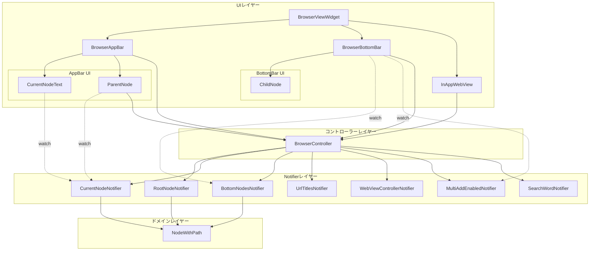
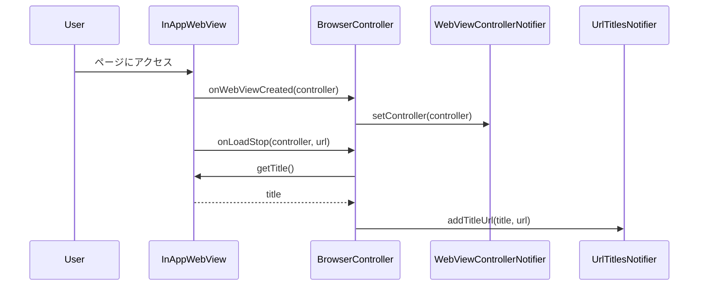
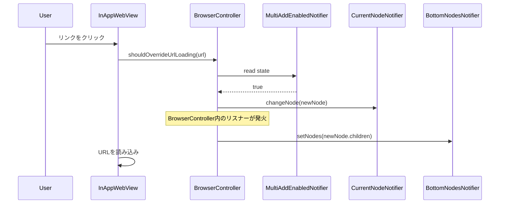
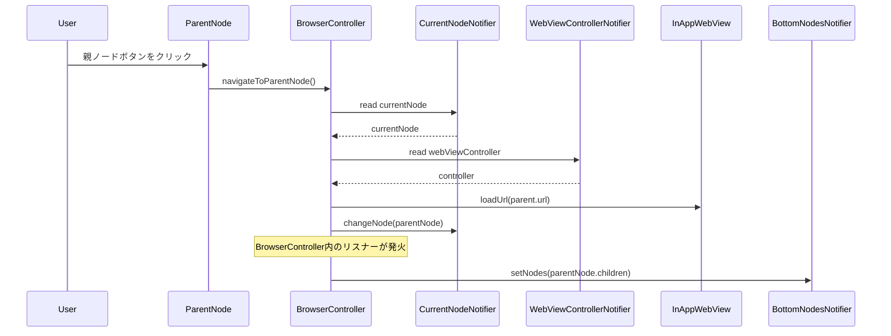
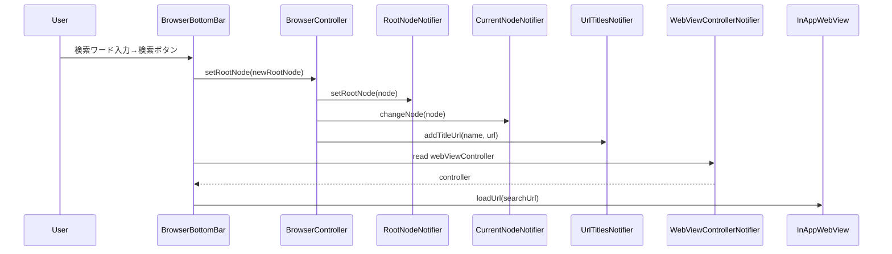
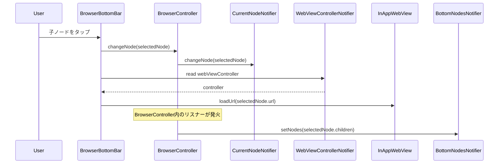
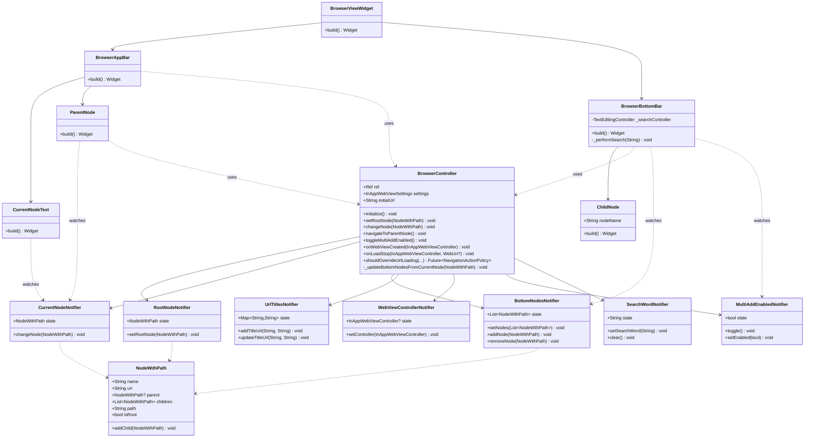

# ブラウザー機能のUI・Notifier結合設計

## 概要

本ドキュメントでは、Web Browserアプリケーションにおける、UIコンポーネントとNotifier（状態管理）の結合設計について説明します。

## アーキテクチャ概要

本アプリケーションは以下のレイヤー構成を採用しています：

- **UIレイヤー**: ユーザーに表示されるWidgetコンポーネント
- **コントローラーレイヤー**: UIとNotifierを仲介し、ビジネスロジックを管理
- **Notifierレイヤー**: Riverpodを用いた状態管理
- **ドメインレイヤー**: データモデル（NodeWithPath等）

## 全体構成図



## Notifier詳細

### 1. RootNodeNotifier

**責務**: 履歴ツリーのルートノードを管理

| プロパティ | 型 | 説明 |
|----------|-----|------|
| state | NodeWithPath | 現在のルートノード |

| メソッド | 説明 |
|---------|------|
| setRootNode(NodeWithPath) | ルートノードを設定 |

**提供**: `rootNodeNotifierProvider`

---

### 2. CurrentNodeNotifier

**責務**: 現在表示中のノードを管理

| プロパティ | 型 | 説明 |
|----------|-----|------|
| state | NodeWithPath | 現在のノード |

| メソッド | 説明 |
|---------|------|
| changeNode(NodeWithPath) | 現在ノードを変更 |

**提供**: `currentNodeNotifierProvider`

**依存**: RootNodeNotifierを初期値として参照

---

### 3. BottomNodesNotifier

**責務**: 下部バーに表示する子ノードリストを管理

| プロパティ | 型 | 説明 |
|----------|-----|------|
| state | List\<NodeWithPath\> | 子ノードのリスト |

| メソッド | 説明 |
|---------|------|
| setNodes(List\<NodeWithPath\>) | ノードリスト全体を設定 |
| addNode(NodeWithPath) | ノードを追加（重複チェック付き） |
| removeNode(NodeWithPath) | ノードを削除 |

**提供**: `bottomNodesNotifierProvider`

---

### 4. UrlTitlesNotifier

**責務**: タイトルとURLのマッピングを管理

| プロパティ | 型 | 説明 |
|----------|-----|------|
| state | Map\<String, String\> | タイトル→URLのマップ |

| メソッド | 説明 |
|---------|------|
| addTitleUrl(String, String) | タイトルとURLを追加 |
| updateTitleUrl(String, String) | URLを更新 |

**提供**: `urlTitlesNotifierProvider`

---

### 5. WebViewControllerNotifier

**責務**: InAppWebViewControllerを保持

| プロパティ | 型 | 説明 |
|----------|-----|------|
| state | InAppWebViewController? | WebViewコントローラー |

| メソッド | 説明 |
|---------|------|
| setController(InAppWebViewController) | コントローラーを設定 |

**提供**: `webViewControllerNotifierProvider`

---

### 6. MultiAddEnabledNotifier

**責務**: リンククリック時の自動ノード追加ON/OFFを管理

| プロパティ | 型 | 説明 |
|----------|-----|------|
| state | bool | 有効/無効フラグ（初期値: true） |

| メソッド | 説明 |
|---------|------|
| toggle() | 状態を切り替え |
| setEnabled(bool) | 明示的に設定 |

**提供**: `multiAddEnabledNotifierProvider`

---

### 7. SearchWordNotifier

**責務**: 検索バーの入力値を管理

| プロパティ | 型 | 説明 |
|----------|-----|------|
| state | String | 検索ワード |

| メソッド | 説明 |
|---------|------|
| setSearchWord(String) | 検索ワードを設定 |
| clear() | 検索ワードをクリア |

**提供**: `searchWordNotifierProvider`

---

## BrowserController

**責務**: UIとNotifierを仲介し、ビジネスロジックを統合管理

### 主要メソッド

| メソッド | 説明 | 使用するNotifier |
|---------|------|----------------|
| setRootNode(NodeWithPath) | ルートノードを設定 | RootNodeNotifier, CurrentNodeNotifier, UrlTitlesNotifier |
| changeNode(NodeWithPath) | 現在ノードを変更 | CurrentNodeNotifier |
| navigateToParentNode() | 親ノードに戻る | CurrentNodeNotifier, WebViewControllerNotifier |
| toggleMultiAddEnabled() | 複数追加モードの切替 | MultiAddEnabledNotifier |
| onWebViewCreated(...) | WebView生成時のコールバック | WebViewControllerNotifier |
| onLoadStop(...) | ページ読込完了時のコールバック | UrlTitlesNotifier |
| shouldOverrideUrlLoading(...) | リンククリック時のコールバック | CurrentNodeNotifier, MultiAddEnabledNotifier |

### リスナー

BrowserControllerは以下のリスナーを登録：

```dart
ref.listen<NodeWithPath>(currentNodeNotifierProvider, (previous, next) {
  _updateBottomNodesFromCurrentNode(next);
});
```

- **CurrentNodeNotifier**の変更を監視
- 現在ノードが変更されると、その子ノードを**BottomNodesNotifier**に自動反映

---

## UI・Notifier結合マトリックス

| UIコンポーネント | watchするNotifier | 操作するController/Notifier | 説明 |
|---------------|-----------------|------------------------|------|
| **CurrentNodeText** | currentNodeNotifierProvider | - | 現在ノードの名前を表示 |
| **ParentNode** | currentNodeNotifierProvider | browserControllerProvider | 親ノード名を表示、クリックで親に遷移 |
| **BrowserAppBar** | - | browserControllerProvider | ルートボタンでルートノードに遷移 |
| **BrowserBottomBar** | bottomNodesNotifierProvider, multiAddEnabledNotifierProvider | browserControllerProvider | 子ノード一覧表示、STAYスイッチ、検索機能 |
| **ChildNode** | - | - | 子ノードの名前を表示（stateless） |
| **InAppWebView** | - | browserControllerProvider | Webページ表示、各種イベントをControllerに通知 |

---

## データフロー図

### 1. ページ読み込みフロー



### 2. リンククリックフロー（STAY有効時）



### 3. 親ノード遷移フロー



### 4. 検索実行フロー



### 5. 子ノード選択フロー



---

## クラス図



---

## 設計原則

### 1. 単一責任の原則（SRP）

各Notifierは1つの状態のみを管理し、責務を明確に分離しています。

- **RootNodeNotifier**: ルートノードのみ
- **CurrentNodeNotifier**: 現在ノードのみ
- **BottomNodesNotifier**: 子ノードリストのみ
- 等々

### 2. 関心の分離（SoC）

- **UIレイヤー**: 表示とユーザー入力のみを担当
- **コントローラーレイヤー**: ビジネスロジックと状態の調整
- **Notifierレイヤー**: 状態の保持と更新
- **ドメインレイヤー**: データ構造の定義

### 3. 依存性の逆転（DIP）

UIはNotifierに直接依存せず、Providerを介してアクセスします。これにより、テスト時にモックへの置き換えが容易になります。

### 4. 単方向データフロー

```
User Action → UI Component → Controller → Notifier → State Update → UI Re-render
```

データは一方向に流れ、状態の予測可能性を保証します。

---

## 状態管理パターン

### Watchパターン

UIコンポーネントは`ref.watch()`を使用してNotifierの状態を監視します。

```dart
final currentNode = ref.watch(currentNodeNotifierProvider);
```

状態が変更されると、自動的にUIが再構築されます。

### Readパターン

一度だけ値を読み取る場合や、イベントハンドラ内で使用する場合は`ref.read()`を使用します。

```dart
final controller = ref.read(browserControllerProvider);
controller.changeNode(newNode);
```

### Listenパターン

BrowserControllerは`ref.listen()`を使用して、CurrentNodeNotifierの変更を監視し、BottomNodesNotifierを自動更新します。

```dart
ref.listen<NodeWithPath>(currentNodeNotifierProvider, (previous, next) {
  _updateBottomNodesFromCurrentNode(next);
});
```

---

## 拡張性の考慮

### 新しいNotifierの追加

新しい状態が必要になった場合、以下の手順で追加できます：

1. `notifiers/`ディレクトリに新しいNotifierクラスを作成
2. BrowserControllerに新しいNotifierへのアクセサを追加
3. 必要に応じてUIコンポーネントから`ref.watch()`で監視

### 新しいUIコンポーネントの追加

新しいUI要素が必要になった場合：

1. `ui/`ディレクトリに新しいWidgetを作成
2. 必要なNotifierを`ref.watch()`で監視
3. ユーザーアクションはBrowserControllerのメソッドを呼び出す

---

## テスタビリティ

### Notifierのテスト

各Notifierは独立しているため、単体テストが容易です。

```dart
test('CurrentNodeNotifier changes node', () {
  final container = ProviderContainer();
  final notifier = container.read(currentNodeNotifierProvider.notifier);
  
  final newNode = NodeWithPath(name: "Test", url: "https://test.com");
  notifier.changeNode(newNode);
  
  expect(container.read(currentNodeNotifierProvider), equals(newNode));
});
```

### Controllerのテスト

BrowserControllerはRefに依存しているため、ProviderContainerを使用してテストします。

### UIのテスト

WidgetテストではProviderScopeでラップし、必要に応じてOverrideを使用してモックを注入します。

---

## まとめ

本アプリケーションのUI・Notifier結合設計は以下の特徴を持ちます：

1. **明確な責務分離**: 各Notifierが単一の状態を管理
2. **中央集約型コントローラー**: BrowserControllerがビジネスロジックを統合管理
3. **リアクティブな状態管理**: Riverpodによる効率的な再描画
4. **高いテスタビリティ**: 各層が独立してテスト可能
5. **拡張性**: 新しい機能の追加が容易な構造

この設計により、保守性と拡張性の高いアプリケーションアーキテクチャを実現しています。
