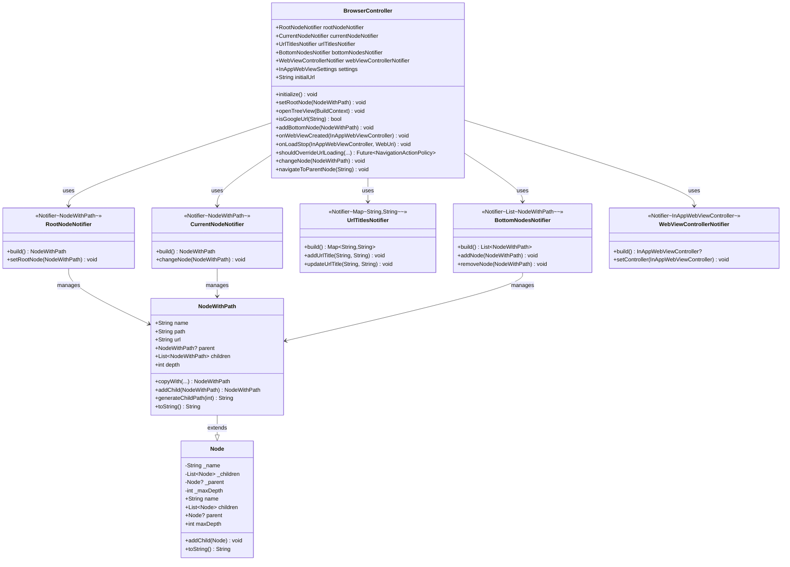

# ブラウザ機能アーキテクチャ図

## 概要

本ドキュメントは、ブラウザ機能のクラス構造を図表で説明します。
Flutter公式アーキテクチャに準拠し、状態項目ごとにNotifierを分離した設計となっています。

## クラス図

以下のクラス図は、ブラウザ機能の主要なクラスとその関係性を示しています。



## アーキテクチャの特徴

### 1. 状態の分離管理

各状態項目（ルートノード、現在ノード、URLタイトル、下部ノード、WebViewコントローラー）を個別のNotifierで管理することで：

- **パフォーマンス向上**: 必要な状態のみが更新され、無駄な再初期化を削減
- **保守性向上**: 各状態の責任が明確で、変更の影響範囲が限定的
- **テスト容易性**: 各Notifierを独立してテストできる

### 2. BrowserControllerの役割

BrowserControllerは、各Notifierを統合して提供する役割を持ちます：

- 各Notifierへのアクセスを一元化
- WebViewイベントの処理とビジネスロジックの実行
- UIレイヤーに対する統一的なインターフェースの提供

### 3. NodeWithPathの設計

NodeWithPathクラスは以下の特徴を持ちます：

- **イミュータブル**: 状態の予測可能性を保証
- **パスID**: ツリー構造内での位置を一意に識別（例: "0", "1-1", "1-2-3"）
- **Node継承**: 既存のNodeクラスの機能を活用

#### パスIDの例

```
ルートノード: path = "0"
├─ 第1子: path = "1-1"
│  ├─ 第1子の第1子: path = "1-1-1"
│  └─ 第1子の第2子: path = "1-1-2"
└─ 第2子: path = "1-2"
   ├─ 第2子の第1子: path = "1-2-1"
   └─ 第2子の第2子: path = "1-2-2"
       └─ 第2子の第2子の第1子: path = "1-2-2-1"
```

### 4. Providerの構成

各Notifierは対応するProviderを通じてUIレイヤーに提供されます：

```
browserControllerProvider (Provider<BrowserController>)
├─ rootNodeNotifierProvider (NotifierProvider<RootNodeNotifier, NodeWithPath>)
├─ currentNodeNotifierProvider (NotifierProvider<CurrentNodeNotifier, NodeWithPath>)
├─ urlTitlesNotifierProvider (NotifierProvider<UrlTitlesNotifier, Map<String, String>>)
├─ bottomNodesNotifierProvider (NotifierProvider<BottomNodesNotifier, List<NodeWithPath>>)
└─ webViewControllerNotifierProvider (NotifierProvider<WebViewControllerNotifier, InAppWebViewController?>)
```

### 5. データフロー

```
User Action (UI Layer)
    ↓
BrowserController method call
    ↓
Individual Notifier updates
    ↓
State change notification
    ↓
UI rebuild (automatic)
```

## まとめ

本アーキテクチャは、Flutter公式アーキテクチャガイドラインに準拠し、以下の原則に基づいて設計されています：

1. **関心の分離**: 各状態項目を独立したNotifierで管理
2. **イミュータビリティ**: NodeWithPathの不変性による予測可能な状態管理
3. **統一的なアクセス**: BrowserControllerによる一元的な操作提供
4. **パフォーマンス最適化**: 必要な状態のみの更新による効率化
5. **テスト容易性**: 各コンポーネントの独立性によるテストの簡素化

これにより、保守性、拡張性、パフォーマンスの高いブラウザ機能を実現しています。

---

**作成日**: 2025年
**バージョン**: 2.0
