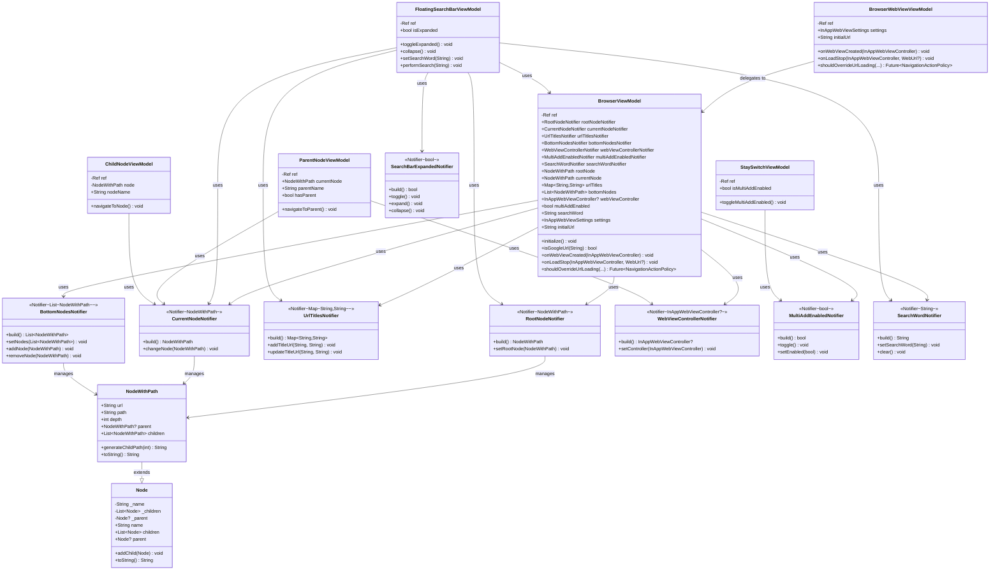

# ブラウザ機能ロジック設計書

Not viewed

**作成日**: 2025年10月  
**更新日**: 2025年11月2日

## 概要

このドキュメントは、Webブラウザ機能のロジック層（ViewModel層）とデータ層（Model層）の設計を記述します。
設計はFlutterの公式アーキテクチャ（<https://docs.flutter.dev/app-architecture>）とMVVMパターンに準拠しています。

## アーキテクチャの概要

本ブラウザ機能は、MVVMアーキテクチャパターンに基づき、以下の層構造で設計されています：

1. **View Layer（ビューレイヤー）**: ユーザーインターフェースの描画を担当。Widgetで構成される。
2. **ViewModel Layer（ビューモデルレイヤー）**: ビジネスロジックと状態管理を担当。ViewとModelの仲介役。
3. **Model Layer（モデルレイヤー）**: データ構造とドメインロジックを担当。

### 状態管理の方針

- **Riverpod**: 状態管理ライブラリとしてRiverpodを使用
- **Notifier**: 各状態項目を個別のNotifierクラスで管理し、リアクティブな状態更新を実現
- **ViewModel**: 各UI コンポーネントに対応するViewModelクラスを配置し、Notifierへのアクセスと操作ロジックを提供
- **階層的ViewModel構造**:
  - `BrowserViewModel`: ブラウザ全体の統括的なViewModel
  - Component ViewModel: 各UIコンポーネント用の個別ViewModel（例: `FloatingSearchBarViewModel`、`ParentNodeViewModel`など）

## クラス一覧

### ViewModel層

#### 1. BrowserViewModel

**概要**: ブラウザ全体の状態と操作を統括するメインViewModel

**役割**: 各Notifierへのアクセスを提供し、WebViewイベントの処理とナビゲーション制御を行う

**パブリックプロパティ**:

- `RootNodeNotifier rootNodeNotifier` - ルートノード管理用Notifierへのアクセス
- `CurrentNodeNotifier currentNodeNotifier` - 現在ノード管理用Notifierへのアクセス
- `UrlTitlesNotifier urlTitlesNotifier` - URLタイトルマップ管理用Notifierへのアクセス
- `BottomNodesNotifier bottomNodesNotifier` - 下部バー用ノードリスト管理用Notifierへのアクセス
- `WebViewControllerNotifier webViewControllerNotifier` - WebViewコントローラー管理用Notifierへのアクセス
- `MultiAddEnabledNotifier multiAddEnabledNotifier` - 複数ノード追加の有効/無効を管理するNotifierへのアクセス
- `SearchWordNotifier searchWordNotifier` - 検索ワード管理用Notifierへのアクセス
- `NodeWithPath rootNode` - ルートノードの取得
- `NodeWithPath currentNode` - 現在ノードの取得
- `Map<String, String> urlTitles` - URLタイトルマップの取得
- `List<NodeWithPath> bottomNodes` - 下部ノードリストの取得
- `InAppWebViewController? webViewController` - WebViewコントローラーの取得
- `bool multiAddEnabled` - 複数ノード追加の有効状態の取得
- `String searchWord` - 検索ワードの取得
- `InAppWebViewSettings settings` - WebViewの設定（JavaScript有効化等）
- `String initialUrl` - アプリ起動時の初期URL（Google検索ページ: `https://www.google.com/`）

**パブリックメソッド**:

- `void initialize()` - コントローラーの初期化（将来の拡張用）
- `bool isGoogleUrl(String url)` - GoogleのURLか判定
- `void onWebViewCreated(InAppWebViewController controller)` - WebView生成時のコールバック。WebViewControllerNotifierに設定
- `void onLoadStop(InAppWebViewController controller, WebUri? loadedUrl)` - ページ読み込み完了時のコールバック。ページタイトルを取得してURLとともにUrlTitlesNotifierに追加
- `Future<NavigationActionPolicy> shouldOverrideUrlLoading(InAppWebViewController controller, NavigationAction navigationAction)` - リンククリック時のコールバック。multiAddEnabledがtrueの場合、新しいノードを作成して現在ノードに設定

**Provider**: `browserViewModelProvider` (Provider\<BrowserViewModel\>)

#### 2. BrowserWebViewViewModel

**概要**: WebView コンポーネント専用のViewModel

**役割**: WebViewの設定と各種イベントハンドラをBrowserViewModelに委譲

**パブリックプロパティ**:

- `InAppWebViewSettings settings` - WebViewの設定
- `String initialUrl` - 初期URL

**パブリックメソッド**:

- `void onWebViewCreated(InAppWebViewController controller)` - WebView生成時のコールバック
- `void onLoadStop(InAppWebViewController controller, WebUri? url)` - ページ読み込み完了時のコールバック
- `Future<NavigationActionPolicy> shouldOverrideUrlLoading(InAppWebViewController controller, NavigationAction navigationAction)` - URL読み込み前のコールバック

**Provider**: `browserWebViewViewModelProvider` (Provider\<BrowserWebViewViewModel\>)

#### 3. FloatingSearchBarViewModel

**概要**: フローティング検索バー用のViewModel

**役割**: 検索バーの展開状態と検索処理を管理

**パブリックプロパティ**:

- `bool isExpanded` - 検索バーが展開されているか

**パブリックメソッド**:

- `void toggleExpanded()` - 検索バーの展開状態を切り替え
- `void collapse()` - 検索バーを折りたたむ
- `void setSearchWord(String word)` - 検索ワードを設定
- `void performSearch(String searchWord)` - 検索を実行。新しいルートノードを作成し、WebViewで検索URLを読み込む

**Provider**: `floatingSearchBarViewModelProvider` (Provider\<FloatingSearchBarViewModel\>)

#### 4. StaySwitchViewModel

**概要**: Stay Switchコンポーネント用のViewModel

**役割**: 複数追加モードの状態と切り替え処理を管理

**パブリックプロパティ**:

- `bool isMultiAddEnabled` - 複数追加モードが有効かどうか

**パブリックメソッド**:

- `void toggleMultiAddEnabled()` - 複数追加モードの切り替え

**Provider**: `staySwitchViewModelProvider` (Provider\<StaySwitchViewModel\>)

#### 5. ParentNodeViewModel

**概要**: 親ノード表示・遷移用のViewModel

**役割**: 親ノードの情報と親ノードへの遷移処理を管理

**パブリックプロパティ**:

- `NodeWithPath currentNode` - 現在のノード
- `String parentName` - 親ノードの名前
- `bool hasParent` - 親ノードが存在するかどうか

**パブリックメソッド**:

- `void navigateToParent()` - 親ノードへ遷移。WebViewで親ノードのURLを読み込み、CurrentNodeNotifierを更新

**Provider**: `parentNodeViewModelProvider` (Provider\<ParentNodeViewModel\>)

#### 6. ChildNodeViewModel

**概要**: 子ノード表示・遷移用のViewModel

**役割**: 子ノードへの遷移処理を管理

**パブリックプロパティ**:

- `NodeWithPath node` - 対象のノード
- `String nodeName` - ノード名

**パブリックメソッド**:

- `void navigateToNode()` - 子ノードに遷移。CurrentNodeNotifierを更新

**Provider**: `childNodeViewModelProvider` (Provider.family\<ChildNodeViewModel, NodeWithPath\>)

### Notifier層（状態管理）

#### 1. RootNodeNotifier

**概要**: ルートノードを管理するNotifierクラス

**役割**: 履歴ツリーのルートノードの状態管理

**状態型**: `NodeWithPath`

**パブリックメソッド**:

- `NodeWithPath build()` - 初期ルートノード（空のルートノード）を構築
- `void setRootNode(NodeWithPath node)` - ルートノードの設定

**Provider**: `rootNodeNotifierProvider` (NotifierProvider)

#### 2. CurrentNodeNotifier

**概要**: 現在のノードを管理するNotifierクラス

**役割**: 現在表示中のノードの状態管理。他のNotifierはこのNotifierの状態を参照する

**状態型**: `NodeWithPath`

**パブリックメソッド**:

- `NodeWithPath build()` - 初期ノード（暫定的なルートノード）を構築
- `void changeNode(NodeWithPath node)` - 現在ノードの変更

**TODO**: ROOTノードをRootNodeNotifierから取得するように修正予定

**Provider**: `currentNodeNotifierProvider` (NotifierProvider)

#### 3. UrlTitlesNotifier

**概要**: タイトルとURLのマッピングを管理するNotifierクラス

**役割**: 各ページタイトルに対応するURLの管理

**状態型**: `Map<String, String>`

**パブリックメソッド**:

- `Map<String, String> build()` - 初期マップの構築（GoogleのタイトルとURLを登録）
- `void addTitleUrl(String title, String url)` - タイトルとURLを追加
- `void updateTitleUrl(String title, String url)` - タイトルとURLを更新

**Provider**: `urlTitlesNotifierProvider` (NotifierProvider)

#### 4. BottomNodesNotifier

**概要**: 下部バーに表示するノードリストを管理するNotifierクラス

**役割**: 現在のノードの子ノードの状態管理

**状態型**: `List<NodeWithPath>`

**パブリックメソッド**:

- `List<NodeWithPath> build()` - 初期リストの構築（空リスト）
- `void setNodes(List<NodeWithPath> nodes)` - ノードリスト全体を設定
- `void addNode(NodeWithPath node)` - ノードを追加（重複チェック付き）
- `void removeNode(NodeWithPath node)` - ノードを削除

**Provider**: `bottomNodesNotifierProvider` (NotifierProvider)

#### 5. WebViewControllerNotifier

**概要**: WebViewコントローラーを管理するNotifierクラス

**役割**: InAppWebViewControllerの保持と提供

**状態型**: `InAppWebViewController?`

**パブリックメソッド**:

- `InAppWebViewController? build()` - 初期状態（null）の構築
- `void setController(InAppWebViewController controller)` - コントローラーの設定

**Provider**: `webViewControllerNotifierProvider` (NotifierProvider)

#### 6. MultiAddEnabledNotifier

**概要**: 複数ノード追加の有効/無効を管理するNotifierクラス

**役割**: リンククリック時に自動的に新しいノードを追加するかを制御（Stay Switch機能）

**状態型**: `bool`

**パブリックメソッド**:

- `bool build()` - 初期状態（true: 有効）の構築
- `void toggle()` - 状態を切り替え
- `void setEnabled(bool enabled)` - 明示的に設定

**Provider**: `multiAddEnabledNotifierProvider` (NotifierProvider)

#### 7. SearchWordNotifier

**概要**: 検索ワードを管理するNotifierクラス

**役割**: 検索バーの入力値の状態管理

**状態型**: `String`

**パブリックメソッド**:

- `String build()` - 初期状態（空文字列）の構築
- `void setSearchWord(String word)` - 検索ワードを設定
- `void clear()` - 検索ワードをクリア

**Provider**: `searchWordNotifierProvider` (NotifierProvider)

#### 8. SearchBarExpandedNotifier

**概要**: 検索バーの展開状態を管理するNotifierクラス

**役割**: 検索バーのUI展開状態の管理

**状態型**: `bool`

**パブリックメソッド**:

- `bool build()` - 初期状態（false: 折りたたみ）の構築
- `void toggle()` - 展開状態を切り替え
- `void expand()` - 検索バーを展開
- `void collapse()` - 検索バーを折りたたむ

**Provider**: `searchBarExpandedNotifierProvider` (NotifierProvider)

#### 9. AddHoldTimerNotifier（未実装）

**概要**: 長押しタイマーを管理するNotifierクラス

**役割**: ノード追加時の長押し操作のタイマー管理（将来実装予定）

**状態型**: `Timer?`（予定）

**備考**: 現在、ファイルは空で未実装

### Model層（データモデル）

#### 1. Node

**概要**: ツリー構造のノードを表すデータモデル

**役割**: 履歴ツリーの各要素を表現し、親子関係を管理

**パブリックプロパティ**:

- `String name` - ノードの名前（プライベートフィールド `_name` のgetter）
- `List<Node> children` - 子ノードのリスト（プライベートフィールド `_children` のgetter）
- `Node? parent` - 親ノード（プライベートフィールド `_parent` のgetter。nullはルートノードを示す）

**パブリックメソッド**:

- `Node(String name, [Node? parent])` - コンストラクタ。親ノードが指定されている場合、親の子リストに自身を追加（重複チェック付き）
- `void addChild(Node childNode)` - 子ノードの追加（重複チェック付き）
- `String toString()` - 文字列表現（名前を返す）

#### 2. NodeWithPath

**概要**: パスIDを持つノードクラス

**役割**: ツリー構造内でのノードの位置を一意に識別するパスIDを持つノード。Nodeクラスを継承

**パブリックプロパティ**:

- `String name` - ノードの名前（Nodeクラスから継承）
- `String path` - ノードのパスID（例: "0", "1-1", "1-2-3"）
- `String url` - ノードに紐づくURL
- `int depth` - ノードの階層（ルート:0, 1階層:1, ...）親を辿って計算される
- `NodeWithPath? parent` - 親ノード（NodeWithPath型にキャスト）
- `List<NodeWithPath> children` - 子ノードのリスト（NodeWithPath型にフィルタリング）

**パブリックメソッド**:

- `NodeWithPath({required String name, required String url, required NodeWithPath parent})` - 通常のコンストラクタ。パスは親から自動計算される
- `NodeWithPath.root({required String name, required String url})` - ルートノード用コンストラクタ。パスは"0"に固定
- `String generateChildPath(int childIndex)` - 子ノードのパスIDを生成（例: "1-1" の子は "1-1-1", "1-1-2"...）
- `String toString()` - 文字列表現（名前とパスを返す）

**パス計算ロジック**:

- ルートノードの場合: "0"
- ルートの子ノードの場合: "1-1", "1-2", "1-3"...
- それ以外の場合: 親のパス + "-" + 子インデックス（例: "1-2" → "1-2-1", "1-2-2"...）

## Riverpod Providerの定義

### ViewModelのProvider

| Provider名 | 型 | 役割 |
|-----------|-----|------|
| `browserViewModelProvider` | `Provider\<BrowserViewModel\>` | BrowserViewModelのインスタンスを提供 |
| `browserWebViewViewModelProvider` | `Provider\<BrowserWebViewViewModel\>` | BrowserWebViewViewModelのインスタンスを提供 |
| `floatingSearchBarViewModelProvider` | `Provider\<FloatingSearchBarViewModel\>` | FloatingSearchBarViewModelのインスタンスを提供 |
| `staySwitchViewModelProvider` | `Provider\<StaySwitchViewModel\>` | StaySwitchViewModelのインスタンスを提供 |
| `parentNodeViewModelProvider` | `Provider\<ParentNodeViewModel\>` | ParentNodeViewModelのインスタンスを提供 |
| `childNodeViewModelProvider` | `Provider.family\<ChildNodeViewModel, NodeWithPath\>` | ChildNodeViewModelのインスタンスを提供（パラメータ付き） |

### NotifierのProvider

| Provider名 | 型 | 状態型 | 役割 |
|-----------|-----|--------|------|
| `rootNodeNotifierProvider` | `NotifierProvider\<RootNodeNotifier, NodeWithPath\>` | `NodeWithPath` | ルートノードの状態を提供 |
| `currentNodeNotifierProvider` | `NotifierProvider\<CurrentNodeNotifier, NodeWithPath\>` | `NodeWithPath` | 現在のノード状態を提供 |
| `urlTitlesNotifierProvider` | `NotifierProvider\<UrlTitlesNotifier, Map\<String, String\>\>` | `Map\<String, String\>` | タイトルとURLのマッピングを提供 |
| `bottomNodesNotifierProvider` | `NotifierProvider\<BottomNodesNotifier, List\<NodeWithPath\>\>` | `List\<NodeWithPath\>` | 下部バー用のノードリストを提供 |
| `webViewControllerNotifierProvider` | `NotifierProvider\<WebViewControllerNotifier, InAppWebViewController?\>` | `InAppWebViewController?` | WebViewコントローラーを提供 |
| `multiAddEnabledNotifierProvider` | `NotifierProvider\<MultiAddEnabledNotifier, bool\>` | `bool` | 複数ノード追加の有効/無効状態を提供 |
| `searchWordNotifierProvider` | `NotifierProvider\<SearchWordNotifier, String\>` | `String` | 検索ワードを提供 |
| `searchBarExpandedNotifierProvider` | `NotifierProvider\<SearchBarExpandedNotifier, bool\>` | `bool` | 検索バーの展開状態を提供 |

## UMLクラス図

### アーキテクチャ全体図



## 主要な処理フロー

### 1. アプリ起動時の処理

```text
アプリ起動
    ↓
BrowserView（ProviderScope）が構築
    ↓
各Notifierが初期化（build()メソッドが実行）
    - RootNodeNotifier: 空のルートノード作成
    - CurrentNodeNotifier: 暫定的なルートノード作成（TODO: RootNodeNotifierから取得予定）
    - UrlTitlesNotifier: Googleのタイトル・URL登録
    - その他のNotifier: 初期状態を設定
    ↓
BrowserWebViewが構築
    ↓
WebView生成（initialUrl: https://www.google.com/）
    ↓
onWebViewCreated() コールバック発火
    ↓
WebViewControllerNotifierにコントローラーを設定
    ↓
Googleページ読み込み完了
    ↓
onLoadStop() コールバック発火
    ↓
UIが表示される
```

### 2. 検索実行時の処理

```text
ユーザー操作（検索バー展開 → 検索ワード入力 → 検索実行）
    ↓
FloatingSearchBarViewModel.performSearch(searchWord) 呼び出し
    ↓
検索URL生成（https://www.google.com/search?q=検索ワード）
    ↓
新しいルートノードを作成（NodeWithPath.root）
    ↓
RootNodeNotifier.setRootNode(newRootNode)
    ↓
CurrentNodeNotifier.changeNode(newRootNode)
    ↓
UrlTitlesNotifier.addTitleUrl(searchWord, searchUrl)
    ↓
WebViewで検索URLを読み込み
    ↓
SearchBarExpandedNotifier.collapse() で検索バーを折りたたむ
    ↓
UIレイヤーが自動的に再描画
```

### 3. ページ読み込み完了時の処理

```text
WebViewでページ遷移
    ↓
onLoadStop() コールバック発火（BrowserWebViewViewModel経由）
    ↓
BrowserViewModel.onLoadStop() 呼び出し
    ↓
WebViewからページタイトル取得
    ↓
UrlTitlesNotifier.addTitleUrl(pageTitle, url)
    ↓
UIレイヤーが自動的に再描画
```

### 4. リンククリック時の処理（multiAddEnabled=trueの場合）

```text
ユーザー操作（リンククリック）
    ↓
shouldOverrideUrlLoading() コールバック発火（BrowserWebViewViewModel経由）
    ↓
BrowserViewModel.shouldOverrideUrlLoading() 呼び出し
    ↓
multiAddEnabledの確認（StaySwitch ON）
    ↓
クリックされたURLを取得
    ↓
新規NodeWithPathを作成
    - name: URL（30文字でトリミング）
    - url: クリックされたURL
    - parent: 現在のノード（currentNode）
    - path: 親から自動計算される
    ↓
CurrentNodeNotifier.changeNode(newNode)
    ↓
NavigationActionPolicy.ALLOW を返却（遷移を許可）
    ↓
WebViewが新しいURLを読み込む
    ↓
onLoadStop()でページタイトルが更新される
    ↓
UIレイヤーが自動的に再描画（下部バーに子ノードが追加表示される）
```

### 5. リンククリック時の処理（multiAddEnabled=falseの場合）

```text
ユーザー操作（リンククリック）
    ↓
shouldOverrideUrlLoading() コールバック発火
    ↓
BrowserViewModel.shouldOverrideUrlLoading() 呼び出し
    ↓
multiAddEnabledの確認（StaySwitch OFF）
    ↓
新規ノード作成をスキップ
    ↓
NavigationActionPolicy.ALLOW を返却（遷移を許可）
    ↓
WebViewが新しいURLを読み込む（ツリーには追加されない）
```

### 6. 親ノードへの遷移

```text
ユーザー操作（親ノードボタン押下）
    ↓
ParentNodeViewModel.navigateToParent() 呼び出し
    ↓
親ノードの存在確認
    ↓
親ノードのURLを取得
    ↓
WebViewで親ノードのURLを読み込み（loadUrl）
    ↓
CurrentNodeNotifier.changeNode(parentNode)
    ↓
UIレイヤーが自動的に再描画
```

### 7. 子ノードへの遷移

```text
ユーザー操作（下部バーの子ノードボタン押下）
    ↓
ChildNodeViewModel.navigateToNode() 呼び出し
    ↓
CurrentNodeNotifier.changeNode(node)
    ↓
（WebViewのURL変更は未実装。TODO）
    ↓
UIレイヤーが自動的に再描画
```

### 8. StaySwitch切り替え時の処理

```text
ユーザー操作（StaySwitchボタン押下）
    ↓
StaySwitchViewModel.toggleMultiAddEnabled() 呼び出し
    ↓
MultiAddEnabledNotifier.toggle()
    ↓
状態が反転（true ↔ false）
    ↓
UIレイヤーが自動的に再描画（スイッチの表示が変わる）
```

### 9. NodeWithPathのパスID生成例

```text
ルートノード: path = "0"
├─ 第1子: path = "1-1"
│  ├─ 第1子の第1子: path = "1-1-1"
│  └─ 第1子の第2子: path = "1-1-2"
└─ 第2子: path = "1-2"
   ├─ 第2子の第1子: path = "1-2-1"
   └─ 第2子の第2子: path = "1-2-2"
       └─ 第2子の第2子の第1子: path = "1-2-2-1"
```

**パス計算ロジック**:

- ルートノード: `"0"`
- ルートの第1子: `"1-1"` （親が"0"の場合は"1-"を接頭辞として付ける）
- ルートの第2子: `"1-2"`
- その他: `親のパス + "-" + 子インデックス`

## 設計上の考慮事項

### 1. MVVMパターンの厳格な適用

- **View層**: UIコンポーネントのみを担当。ビジネスロジックは含まない
- **ViewModel層**: ViewとModelの仲介役。Notifierへのアクセスと操作ロジックを提供
  - 階層的なViewModel構造: BrowserViewModelが全体を統括し、各UIコンポーネント用のViewModelが個別のロジックを担当
- **Model層**: データ構造とドメインロジックのみを担当

### 2. 状態項目ごとの分離管理

- 各状態項目（ルートノード、現在ノード、タイトルURL、下部ノード、WebViewコントローラー、複数追加設定、検索ワード、検索バー展開状態）を個別のNotifierで管理
- BrowserViewModelがこれらを統合して提供することで、状態と操作を分離
- 無駄な再初期化コストを削減し、必要な状態のみが更新される
- ref.watch()により、必要な状態のみを監視し、効率的な再描画を実現

### 3. 自動関係管理とパスID

- `NodeWithPath`はNodeクラスを継承し、親子関係を自動管理
- コンストラクタで親ノードを指定すると、自動的に親の子リストに追加される
- パスIDも親ノードから自動計算され、手動でのパス管理が不要
- パスID（例: "0", "1-1", "1-2-3"）により、ノードの階層的な位置が明確
- 履歴の追跡、階層的なナビゲーション、ノードの検索が容易

### 4. コールバックベースのイベント処理

- WebViewのイベント（ページ読み込み、リンククリック等）はコールバックで処理
- BrowserWebViewViewModelがコールバックを受け取り、BrowserViewModelに委譲
- 各コールバックメソッドは適切な状態更新とビジネスロジックを実行
- 各Notifierを通じて状態を更新することで、関心の分離を実現

### 5. ViewModelの責務分離

- **BrowserViewModel**: ブラウザ全体の統括。WebViewイベントの処理、各Notifierへのアクセス提供
- **Component ViewModel**: 各UIコンポーネント専用のロジック担当
  - BrowserWebViewViewModel: WebView設定とコールバック委譲
  - FloatingSearchBarViewModel: 検索バー展開状態と検索実行
  - StaySwitchViewModel: 複数追加モードの切り替え
  - ParentNodeViewModel: 親ノードへの遷移
  - ChildNodeViewModel: 子ノードへの遷移

### 6. Riverpodによる依存性注入

- すべてのViewModelとNotifierはRiverpodのProviderで提供
- テスタビリティの向上: モックやスタブに置き換えが容易
- Refオブジェクトを通じて他のProviderにアクセス
- Provider.familyによるパラメータ付きViewModel（ChildNodeViewModel）

### 7. リアクティブな状態更新

- NotifierのstateプロパティはImmutableに設計
- state更新時は新しいオブジェクトを生成（スプレッド演算子などを使用）
- ref.watch()により状態変更を監視し、UIが自動的に再描画される
- currentNodeの変更時、関連するUIコンポーネント（親ノード表示、子ノードリストなど）が自動更新

### 8. 拡張性と保守性

- 状態項目ごとのNotifierにより、新しい状態の追加が容易
- NodeクラスによるOOP設計により、データの整合性を保証
- 階層的なViewModel構造により、新しいUIコンポーネントの追加が容易
- 各ViewModelは小さく保たれ、単一責任の原則を遵守

## MVVMアーキテクチャとFlutterベストプラクティスへの準拠

本設計は以下の点でMVVMパターンとFlutter公式アーキテクチャに準拠しています：

1. **状態管理の明確な分離**: View、ViewModel、Modelが明確に分離されている
2. **Riverpodの活用**: Flutter推奨の状態管理ライブラリを使用
3. **イミュータブルな状態**: 状態はイミュータブルに設計され、予測可能
4. **Single Source of Truth**: 各状態に対して単一の情報源（Notifier）を持つ
5. **リアクティブな更新**: 状態変更が自動的にUIに反映される（ref.watch）
6. **テスタビリティ**: ロジックが独立しており、ユニットテストが容易
7. **依存性注入**: RiverpodのProviderによる依存性注入
8. **関心の分離**: 各層が明確な責務を持つ

## 既知の問題点と未実装機能

### 既知の問題点

1. **CurrentNodeNotifierの初期化**: 現在はハードコードされたルートノードを使用。RootNodeNotifierから取得するように修正予定（TODOコメント記載済み）

2. **子ノードへの遷移時のWebView更新**: ChildNodeViewModelのnavigateToNode()では、CurrentNodeNotifierの更新のみを行い、WebViewのURL変更は未実装

3. **BottomNodesの自動更新**: 現在の実装では、currentNodeが変更されても、bottomNodesは自動的に更新されない。将来的にはref.listenで監視して自動更新する予定

### 未実装機能

1. **AddHoldTimerNotifier**: 長押しタイマー機能が未実装。ファイルは空の状態

2. **ツリー表示機能**: ツリービュー表示のUI実装は進行中だが、ViewModel層との接続は不完全

3. **エラーハンドリング**: WebViewのエラー処理が未実装

4. **履歴の永続化**: 現在、アプリ終了時に履歴が失われる。SharedPreferencesやローカルDBによる永続化が必要

5. **ノード検索機能**: パスIDやURLによるノード検索機能が未実装

## 今後の改善計画

### 短期（次のスプリント）

1. CurrentNodeNotifierの初期化をRootNodeNotifierから取得するように修正
2. 子ノードへの遷移時にWebViewのURLを変更する機能を実装
3. BottomNodesの自動更新機能を実装（ref.listenを使用）
4. 基本的なエラーハンドリングを追加

### 中期（2-3スプリント）

1. AddHoldTimerNotifierの実装（長押し操作のサポート）
2. ツリー表示機能とViewModel層の完全な接続
3. 履歴の永続化機能の実装
4. ノード検索機能の実装

### 長期（4スプリント以降）

1. パフォーマンス最適化（大規模なツリー構造での処理）
2. テストカバレッジの向上（ユニットテスト、ウィジェットテスト）
3. アクセシビリティの向上
4. 国際化対応（i18n）

## 参考資料

- [Flutter公式アーキテクチャガイド](https://docs.flutter.dev/app-architecture)
- [Riverpod公式ドキュメント](https://riverpod.dev/)
- [InAppWebView公式ドキュメント](https://inappwebview.dev/)
- MVVMパターンの基本概念
