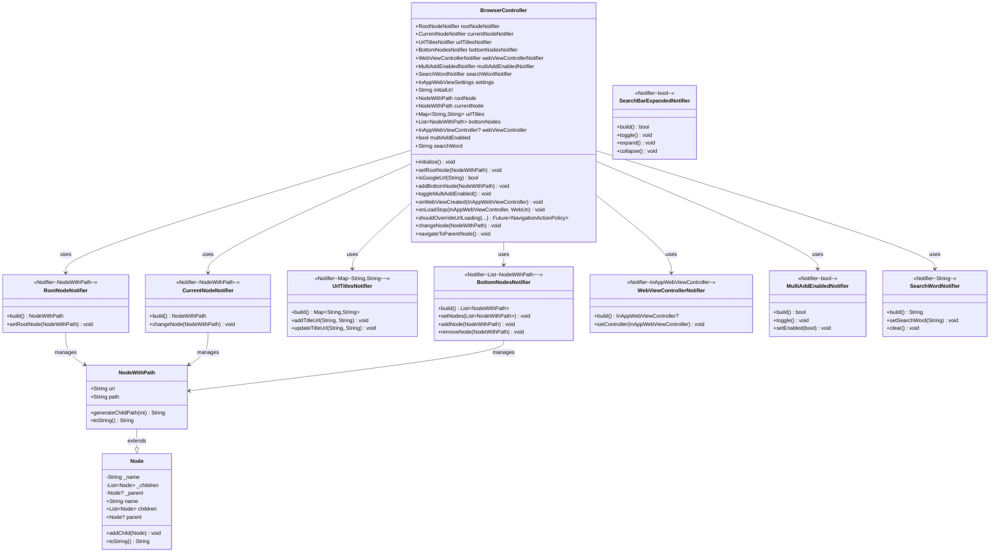

# ブラウザ機能ロジック設計書

## 概要

このドキュメントは、Webブラウザ機能の内、UI以外のロジックの設計を記述します。
設計はFlutterの公式アーキテクチャ（https://docs.flutter.dev/app-architecture）に準拠しています。

## アーキテクチャの概要

本ブラウザ機能は、Flutter公式アーキテクチャの推奨に従い、以下の層構造で設計されています：

1. **UI Layer（UIレイヤー）**: ユーザーインターフェースの描画を担当（本設計書の対象外）
2. **Logic Layer（ロジックレイヤー）**: ビジネスロジックと状態管理を担当（本設計書の対象）
3. **Data Layer（データレイヤー）**: データモデルとドメインロジックを担当（本設計書の対象）

状態管理には**Riverpod**を使用し、**Notifier**パターンでリアクティブな状態管理を実現しています。
各状態項目は個別のNotifierで管理され、BrowserControllerクラスがフィールドとしてこれらを提供します。

## クラス一覧

### 1. BrowserController

**概要**: ブラウザの状態と操作を集約して提供するコントローラークラス

**役割**: 各状態管理Notifierを統合し、WebViewイベントの処理とナビゲーション制御を行う

**パブリックメンバ**:
- `RootNodeNotifier rootNodeNotifier` - ルートノード管理用Notifier
- `CurrentNodeNotifier currentNodeNotifier` - 現在ノード管理用Notifier
- `UrlTitlesNotifier urlTitlesNotifier` - URLタイトルマップ管理用Notifier
- `BottomNodesNotifier bottomNodesNotifier` - 下部バー用ノードリスト管理用Notifier
- `WebViewControllerNotifier webViewControllerNotifier` - WebViewコントローラー管理用Notifier
- `MultiAddEnabledNotifier multiAddEnabledNotifier` - 複数ノード追加の有効/無効を管理するNotifier
- `SearchWordNotifier searchWordNotifier` - 検索ワードを管理するNotifier
- `InAppWebViewSettings settings` - WebViewの設定（JavaScript有効化等）
- `String initialUrl` - アプリ起動時の初期URL（Google検索ページ）

**状態取得用プロパティ**:
- `NodeWithPath rootNode` - ルートノードの取得
- `NodeWithPath currentNode` - 現在ノードの取得
- `Map<String, String> urlTitles` - URLタイトルマップの取得
- `List<NodeWithPath> bottomNodes` - 下部ノードリストの取得
- `InAppWebViewController? webViewController` - WebViewコントローラーの取得
- `bool multiAddEnabled` - 複数ノード追加の有効状態の取得
- `String searchWord` - 検索ワードの取得

**パブリックメソッド**:
- `void initialize()` - コントローラーの初期化
- `void setRootNode(NodeWithPath node)` - ルートノードの設定
- `bool isGoogleUrl(String url)` - GoogleのURLか判定
- `void addBottomNode(NodeWithPath node)` - 下部バーにノードを追加（multiAddEnabledがtrueの場合のみ）
- `void toggleMultiAddEnabled()` - multiAddEnabledの切り替え
- `void onWebViewCreated(InAppWebViewController controller)` - WebView生成時のコールバック
- `void onLoadStop(InAppWebViewController controller, WebUri? loadedUrl)` - ページ読み込み完了時のコールバック
- `Future<NavigationActionPolicy> shouldOverrideUrlLoading(...)` - リンククリック時のコールバック
- `void changeNode(NodeWithPath node)` - 現在ノードの変更
- `void navigateToParentNode()` - 親ノードへの遷移

### 2. RootNodeNotifier

**概要**: ルートノードを管理するNotifierクラス

**役割**: 履歴ツリーのルートノードの状態管理

**パブリックメソッド**:
- `NodeWithPath build()` - 初期ルートノードの構築
- `void setRootNode(NodeWithPath node)` - ルートノードの設定

### 3. CurrentNodeNotifier

**概要**: 現在のノードを管理するNotifierクラス

**役割**: 現在表示中のノードの状態管理

**パブリックメソッド**:
- `NodeWithPath build()` - 初期ノードの構築
- `void changeNode(NodeWithPath node)` - 現在ノードの変更

### 4. UrlTitlesNotifier

**概要**: タイトルとURLのマッピングを管理するNotifierクラス

**役割**: 各タイトルに対応するページURLの管理

**パブリックメソッド**:

- `Map<String, String> build()` - 初期マップの構築
- `void addTitleUrl(String title, String url)` - タイトルとURLを追加
- `void updateTitleUrl(String title, String url)` - タイトルとURLを更新

### 5. BottomNodesNotifier

**概要**: 下部バーに表示するノードリストを管理するNotifierクラス

**役割**: 現在のノードの子ノードの状態管理

**パブリックメソッド**:

- `List<NodeWithPath> build()` - 初期リストの構築
- `void setNodes(List<NodeWithPath> nodes)` - ノードリスト全体を設定
- `void addNode(NodeWithPath node)` - ノードを追加（重複チェック）
- `void removeNode(NodeWithPath node)` - ノードを削除

### 6. WebViewControllerNotifier

**概要**: WebViewコントローラーを管理するNotifierクラス

**役割**: InAppWebViewControllerの保持と提供

**パブリックメソッド**:

- `InAppWebViewController? build()` - 初期状態（null）の構築
- `void setController(InAppWebViewController controller)` - コントローラーの設定

### 7. MultiAddEnabledNotifier

**概要**: 複数ノード追加の有効/無効を管理するNotifierクラス

**役割**: リンククリック時に自動的に新しいノードを追加するかを制御

**パブリックメソッド**:

- `bool build()` - 初期状態（true）の構築
- `void toggle()` - 状態を切り替え
- `void setEnabled(bool enabled)` - 明示的に設定

### 8. SearchWordNotifier

**概要**: 検索ワードを管理するNotifierクラス

**役割**: 検索バーの入力値の状態管理

**パブリックメソッド**:

- `String build()` - 初期状態（空文字列）の構築
- `void setSearchWord(String word)` - 検索ワードを設定
- `void clear()` - 検索ワードをクリア

### 9. SearchBarExpandedNotifier

**概要**: 検索バーの展開状態を管理するNotifierクラス

**役割**: 検索バーのUI展開状態の管理

**パブリックメソッド**:

- `bool build()` - 初期状態（false）の構築
- `void toggle()` - 展開状態を切り替え
- `void expand()` - 検索バーを展開
- `void collapse()` - 検索バーを折りたたむ

### 10. Node

**概要**: ツリー構造のノードを表すデータモデル

**役割**: 履歴ツリーの各要素を表現し、親子関係を管理

**パブリックメンバ**:

- `String name` - ノードの名前（getter）
- `List<Node> children` - 子ノードのリスト（getter）
- `Node? parent` - 親ノード（getter、nullはルートノードを示す）

**パブリックメソッド**:

- `Node(String name, [Node? parent])` - コンストラクタ
- `void addChild(Node childNode)` - 子ノードの追加
- `String toString()` - 文字列表現（名前を返す）

### 11. NodeWithPath

**概要**: パスIDを持つノードクラス

**役割**: ツリー構造内でのノードの位置を一意に識別するパスIDを持つノード。Nodeクラスを継承

**パブリックメンバ**:

- `String name` - ノードの名前
- `String path` - ノードのパスID（例: "0", "1-1", "1-2", "2-1-3"）
- `String url` - ノードに紐づくURL
- `NodeWithPath? parent` - 親ノード
- `List<NodeWithPath> children` - 子ノードのリスト（NodeWithPathにキャスト）

**パブリックメソッド**:

- `NodeWithPath({required String name, required String url, required NodeWithPath parent})` - 通常のコンストラクタ（パスは親から自動計算）
- `NodeWithPath.root({required String name, required String url, required String path})` - ルートノード用コンストラクタ
- `String generateChildPath(int childIndex)` - 子ノードのパスIDを生成（例: "1-1" の子は "1-1-1", "1-1-2"...）
- `String toString()` - 文字列表現（名前とパスを返す）

## Riverpod Providerの定義

### browserControllerProvider

**型**: `Provider<BrowserController>`

**役割**: BrowserControllerのインスタンスを提供し、各Notifierへのアクセスを統合する

### rootNodeNotifierProvider

**型**: `NotifierProvider<RootNodeNotifier, NodeWithPath>`

**役割**: ルートノードの状態を提供

### currentNodeNotifierProvider

**型**: `NotifierProvider<CurrentNodeNotifier, NodeWithPath>`

**役割**: 現在のノード状態を提供

### urlTitlesNotifierProvider

**型**: `NotifierProvider<UrlTitlesNotifier, Map<String, String>>`

**役割**: タイトルとURLのマッピングを提供

### bottomNodesNotifierProvider

**型**: `NotifierProvider<BottomNodesNotifier, List<NodeWithPath>>`

**役割**: 下部バー用のノードリストを提供

### webViewControllerNotifierProvider

**型**: `NotifierProvider<WebViewControllerNotifier, InAppWebViewController?>`

**役割**: WebViewコントローラーを提供

### multiAddEnabledNotifierProvider

**型**: `NotifierProvider<MultiAddEnabledNotifier, bool>`

**役割**: 複数ノード追加の有効/無効状態を提供

### searchWordNotifierProvider

**型**: `NotifierProvider<SearchWordNotifier, String>`

**役割**: 検索ワードを提供

### searchBarExpandedNotifierProvider

**型**: `NotifierProvider<SearchBarExpandedNotifier, bool>`

**役割**: 検索バーの展開状態を提供

## UMLクラス図



## 主要な処理フロー

### 1. ページ読み込み完了時の処理

```text
ユーザー操作（ページ遷移）
    ↓
onLoadStop() コールバック発火
    ↓
ページタイトル取得
    ↓
UrlTitlesNotifierでurlTitlesマップを更新（addTitleUrl）
    ↓
UIレイヤーが自動的に再描画
```

### 2. リンククリック時の処理（multiAddEnabled=trueの場合）

```text
ユーザー操作（リンククリック）
    ↓
shouldOverrideUrlLoading() コールバック発火
    ↓
クリックされたURLを取得
    ↓
新規NodeWithPathを作成（パスは親から自動計算）
    ↓
CurrentNodeNotifierで現在ノードを更新
    ↓
BrowserControllerのlistenにより自動的にbottomNodesが更新
    （Google以外のURLの子ノードのみが抽出される）
    ↓
NavigationActionPolicy.ALLOW を返却（遷移を許可）
```

### 3. ノード変更時の処理

```text
ユーザー操作（履歴ノード選択）
    ↓
changeNode(node) 呼び出し
    ↓
CurrentNodeNotifierで現在ノードを更新
    ↓
BrowserControllerのlistenにより自動的にbottomNodesが更新
    ↓
UIレイヤーが自動的に再描画
```

### 4. 親ノードへの遷移

```text
ユーザー操作（戻るボタン押下）
    ↓
navigateToParentNode() 呼び出し
    ↓
親ノードのURLを取得
    ↓
WebViewで親ノードのURLを読み込み
    ↓
CurrentNodeNotifierで親ノードに変更
    ↓
UIレイヤーが自動的に再描画
```

### 5. NodeWithPathのパスID生成例

```text
ルートノード: path = "0"
├─ 第1子: path = "1-1"
│  ├─ 第1子の第1子: path = "1-1-1"
│  └─ 第1子の第2子: path = "1-1-2"
└─ 第2子: path = "1-2"
   ├─ 第2子の第1子: path = "1-2-1"
   └─ 第2子の第2子: path = "1-2-2"
       └─ 第2子の第2子の第1子: path = "1-2-2-1"
```

## 設計上の考慮事項

### 1. 状態項目ごとの分離管理

- 各状態項目（ルートノード、現在ノード、タイトルURL、下部ノード、WebViewコントローラー、複数追加設定、検索ワード、検索バー展開状態）を個別のNotifierで管理
- BrowserControllerがこれらを統合して提供することで、状態と操作を分離
- 無駄な再初期化コストを削減し、必要な状態のみが更新される

### 2. 自動関係管理

- `NodeWithPath`はNodeクラスを継承し、親子関係を自動管理
- コンストラクタで親ノードを指定すると、自動的に親の子リストに追加される
- パスIDも親ノードから自動計算され、手動でのパス管理が不要

### 3. コールバックベースのイベント処理

- WebViewのイベント（ページ読み込み、リンククリック等）はコールバックで処理
- 各コールバックメソッドは適切な状態更新とビジネスロジックを実行
- 各Notifierを通じて状態を更新することで、関心の分離を実現

### 4. リアクティブな状態連動

- BrowserControllerのコンストラクタでcurrentNodeの変更を監視（ref.listen）
- currentNodeが変更されると、自動的にbottomNodesが更新される
- Google以外のURLの子ノードのみがbottomNodesに反映される

### 5. パスIDによるノード識別

- `NodeWithPath`はツリー構造内での位置を一意に識別するパスIDを持つ
- パスID（例: "0", "1-1", "1-2-3"）により、ノードの階層的な位置が明確
- 履歴の追跡、階層的なナビゲーション、ノードの検索が容易

### 6. 拡張性と保守性

- 状態項目ごとのNotifierにより、新しい状態の追加が容易
- NodeクラスによるOOP設計により、データの整合性を保証
- BrowserControllerを介した統一的なアクセスにより、UIレイヤーからの利用が簡潔

## Flutterアーキテクチャガイドラインへの準拠

本設計は以下の点でFlutter公式アーキテクチャに準拠しています：

1. **状態管理の明確な分離**: UIとロジックが明確に分離されている
2. **Riverpodの活用**: 推奨される状態管理ライブラリを使用
3. **イミュータブルな状態**: 状態はイミュータブルに設計され、予測可能
4. **Single Source of Truth**: 各状態に対して単一の情報源を持つ
5. **リアクティブな更新**: 状態変更が自動的にUIに反映される
6. **テスタビリティ**: ロジックが独立しており、ユニットテストが容易

## 今後の改善点

1. エラーハンドリング: WebViewのエラー処理を強化
2. パフォーマンス最適化: 大規模なツリー構造での処理の最適化
3. 永続化: 履歴データの永続化機能の追加（SharedPreferencesやローカルDBの利用）
4. テストカバレッジ: 各NotifierとBrowserControllerのユニットテストを追加
5. パスID検索: パスIDからNodeWithPathを効率的に検索する機能の追加

---

**作成日**: 2025年10月
**バージョン**: 2.1
