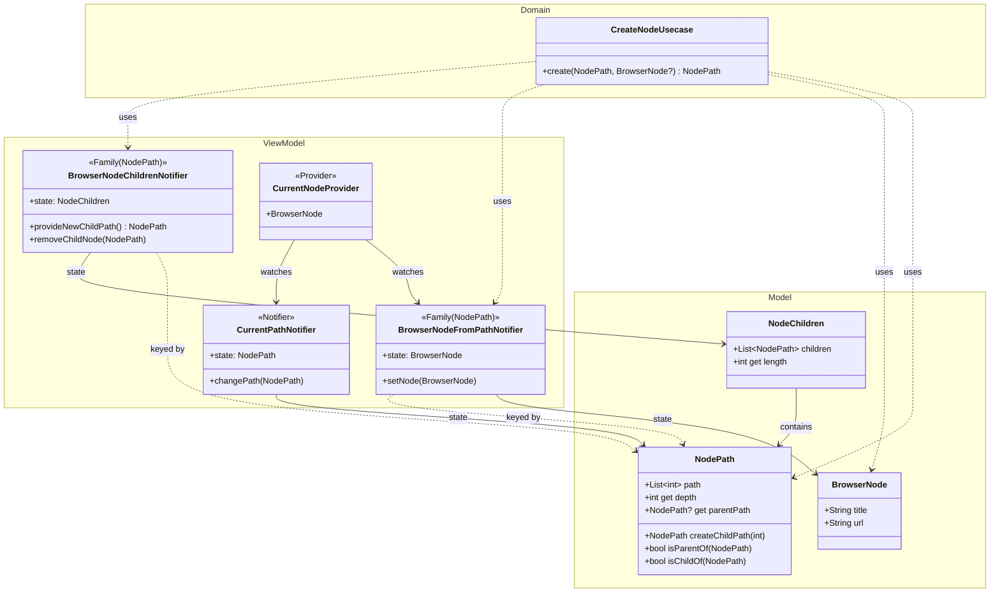

# ブラウザ画面のアーキテクチャ

最終更新: 2025-11-24

## 設計思想

### イミュータブルなツリー 
Flutterの状態管理ではModelはイミュータブル(不変)の必要があるが、動的に変化するツリー構造を無理矢理にイミュータブルにすると、１箇所の変更でツリー全体の再構築が行われ、不要な計算が発生する。

そのため、ツリー構造を以下の3つの要素に分離する。これによって、部分的な更新が可能となり、効率的な状態管理を実現する。

### 状態管理の粒度

- **ノード単体の情報**: `BrowserNode` - ノード自身のタイトル・URL。描画に直接必要な情報。
- **ノードのパス**: `NodePath` - ツリー内の位置。親子の関係を表したり、BrowserNodeのIDとなる。
- **子ノードのコレクション**: `NodeChildren` - 子ノードのパスをリストで保持する。子から親へはパスを辿ることでアクセス可能だが、親から単一の子へはパスを知っていないとアクセスできない。子ノードをリストとして管理することで、親から子へのアクセスが容易になる。

## 主要コンポーネントの責務

### Model層

#### `BrowserNode`

- **責務**: ノード単体の情報を保持
- **特徴**:
  - Freezedでイミュータブルに実装
  - title（ページタイトル）とurl（URL）を保持
  - 子ノードのリストや親情報は持たない

#### `NodePath`

- **責務**: ツリー内の位置を一意に識別
- **特徴**:
  - 整数のリストでパスを表現（例: [0, 2, 1] = ルート→0番目の子→2番目の子→1番目の子）
  - 深さ（depth）や親パス（parentPath）の算出が可能
  - パス比較メソッド（`isParentOf`, `isChildOf`）を提供
  - 文字列変換（`toString`）と文字列からの復元（`fromString`）をサポート

#### `NodeChildren`

- **責務**: 特定ノードの子ノードパスのリストを保持
- **特徴**:
  - Freezedでイミュータブルに実装
  - 子ノードのパスのリストを管理
  - リストではあるが、イミュータブル

### ViewModel層

#### `CurrentPathNotifier`

- **責務**: 現在表示中のノードのパスを管理
- **用途**:
  - WebViewの表示制御
  - UI状態の同期

#### `BrowserNodeFromPathNotifier` (Family)

- **責務**: 各パスに対応するノード情報を保持
- **特徴**:
  - `NodePath`をキーとしたFamily Notifier
  - パスごとのノード情報を管理
  - `setNode()`でノード情報を設定・更新

#### `BrowserNodeChildrenNotifier` (Family)

- **責務**: 各ノードの子パスを管理
- **特徴**:
  - `NodePath`をキーとしたFamily Notifier
  - 子の追加（`provideNewChildPath`）

#### `CurrentNodeProvider`

- **責務**: 現在のノードの情報を提供
- **特徴**:
  - `CurrentPathNotifier`が示しているパスを`BrowserNodeFromPathNotifier`から取得
  - 自動的に最新のノード情報を提供

### Domain層

#### `CreateNodeUsecase`

- **責務**: 新しいノードの作成ロジックをカプセル化
- **処理フロー**:ブラウザ機能全体のReadMeに記載

## 実装のポイント

### パス管理

- ルートパスは空のリスト `[]` で表現
- 第1階層のパスは `[0]`, `[1]`, `[2]` ...
- 第2階層のパスは `[0, 0]`, `[0, 1]`...

### Family Notifierの活用

- `BrowserNodeFromPathNotifier`と`BrowserNodeChildrenNotifier`はFamily Notifier
- パスごとに独立したインスタンスを持つ
- `keepAlive: true`でキャッシュを維持

