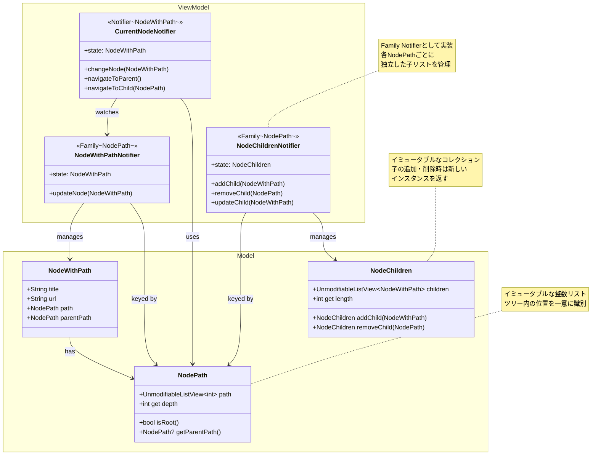

# ブラウザ画面のアーキテクチャ

最終更新: 2025-11-13

## 設計思想

### イミュータブル性の重要性

Flutterの状態管理では、Modelはイミュータブル(不変)である必要があります。
`NodeWithPath`に`NodeChildren`を含めると、子ノードの追加・削除のたびに親ノード全体が再構築され、
ツリー全体の再レンダリングが発生します。そのため、ノード自体の情報と子ノードリストを分離し、
必要な部分のみを更新できるようにしています。

### 状態管理の粒度

- **ノード単体の情報**: `NodeWithPath` - ノード自身のタイトル、URL、パス
- **子ノードのコレクション**: `NodeChildren` - 特定ノードの子リストを管理
- これにより、子の追加時にノード本体を再構築せず、子リストのみを更新可能

## アーキテクチャ図（View層は省略

## 主要コンポーネントの責務

### Model層

#### `NodeWithPath`

- **責務**: ノード単体の情報を保持
- **特徴**:
  - Freezedでイミュータブルに実装
  - 子ノードのリストは持たない(分離により部分更新を実現)
  - パスにより親子関係を識別

#### `NodePath`

- **責務**: ツリー内の位置を一意に識別
- **特徴**:
  - インデックスのリストでパスを表現
  - 深さや親パスの算出が可能

#### `NodeChildren`

- **責務**: 特定ノードの子ノードリストを保持
- **特徴**:
  - イミュータブルなコレクション
  - 追加・削除時は新しいインスタンスを生成

### ViewModel層

#### `CurrentNodeNotifier`

- **責務**: 現在表示中のノードを管理
- **用途**: WebViewの表示制御、UI状態の同期

#### `NodeWithPathNotifier`(Family)

- **責務**: 各パスに対応するノード情報を保持。
- **用途**: ノード情報の更新・取得

#### `NodeChildrenNotifier` (Family)

- **責務**: 各ノードの子リストを独立して管理
- **特徴**:
  - `NodePath`をキーとしたFamily Notifier
  - 子の追加・削除時、該当ノードの子リストのみ更新
  - 他のノードには影響を与えない

### View層

## データフローの例

### 子ノード追加時

1. ユーザーが新しいURLに移動
2. ViewModelが`NodeChildrenNotifier(currentPath)`に新しい`NodeWithPath`を追加
3. `NodeChildren`の新しいインスタンスが生成される
4. 該当する`TreeView`/`NodeWidget`のみが再レンダリング
5. 他のノードは影響を受けない(イミュータブル性 + 粒度の細かい状態管理)

### ノード移動時

1. ユーザーがノードを選択
2. `CurrentNodeNotifier.changeNode()`が呼ばれる
3. `NodeWithPath`が更新される
4. WebViewと関連UIのみが再レンダリング
