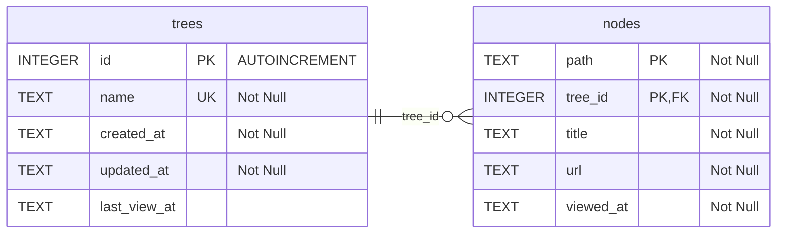

作成: 2026-01-07 JST
更新: 2026-01-07 JST

# データベースドキュメント

## 概要

- ストレージ: SQLite（ファイル名: web_browser.db）
- バージョン: 1（`_databaseVersion`）
- 主な責務: ブラウザツリー（trees）とノード（nodes）の永続化、ツリー切替とノード階層の保持
- 主な実装: [lib/db/database_helper.dart](lib/db/database_helper.dart) がスキーマを管理

## E-R図

## テーブル定義

### trees

- 主キー: `id` INTEGER AUTOINCREMENT
- 列: `name` TEXT NOT NULL UNIQUE, `created_at` TEXT NOT NULL, `updated_at` TEXT NOT NULL,`last_view_at` TEXT
- 用途: 複数のツリーを識別・管理。ノードは必ずどれかのツリーに所属。

### nodes

- 主キー: `path`, `tree_id`（複合キー）
- 外部キー: `tree_id` → trees.id（ON DELETE CASCADE）
- 列: `path` TEXT（`NodePath` の文字列表現、例: `/0/1/2`）、`title` TEXT NOT NULL、`url` TEXT NOT NULL、`viewed_at` TEXT NOT NULL
- インデックス: `idx_nodes_tree_path`（`tree_id`, `path`）
- 用途: ブラウザノードの実体。パスで階層を管理し、同一ツリー内で一意。

## スキーマバージョン履歴

- v1（現行）: trees/nodesテーブル構成で複数ツリー管理を実装。

## データアクセスレイヤ

- DAO: [lib/db/dao/node_dao.dart](lib/db/dao/node_dao.dart), [lib/db/dao/tree_dao.dart](lib/db/dao/tree_dao.dart)
- リポジトリ: [lib/db/repositories/node_repository.dart](lib/db/repositories/node_repository.dart), [lib/db/repositories/tree_repository.dart](lib/db/repositories/tree_repository.dart)
- ツリー選択対応: [lib/db/providers/tree_aware_node_repository.dart](lib/db/providers/tree_aware_node_repository.dart) が `CurrentTreeNotifier` の `treeId` を自動適用
- 現在のツリーID: [lib/db/providers/current_tree_notifier.dart](lib/db/providers/current_tree_notifier.dart)（初期値: 1）

## 設計メモ

- ノード削除は `tree_id` と `path` をキーに実行。`deleteWithDescendants` でパス前方一致削除を行い、ルート指定時はツリー内全削除。
- 子ノード取得は `REGEXP` が無効な環境を考慮し、フォールバックで全件取得後に正規表現で絞り込み。
- ツリー削除時は外部キーの ON DELETE CASCADE により紐づくノードが自動削除。
- `path` は文字列管理のため、アプリ側で `NodePath` を介して一貫性を確保すること。

## 運用・拡張の指針

- スキーマ変更時は `_databaseVersion` をインクリメントし、`_onUpgrade` に移行処理を必ず追加すること。
- 列追加時は既存データのデフォルト値と一意制約、インデックス設計を検討する。
- 大量挿入は `NodeDao.insertAll`（バッチ）を優先し、`ConflictAlgorithm.replace` を利用してパス重複を吸収する設計。
