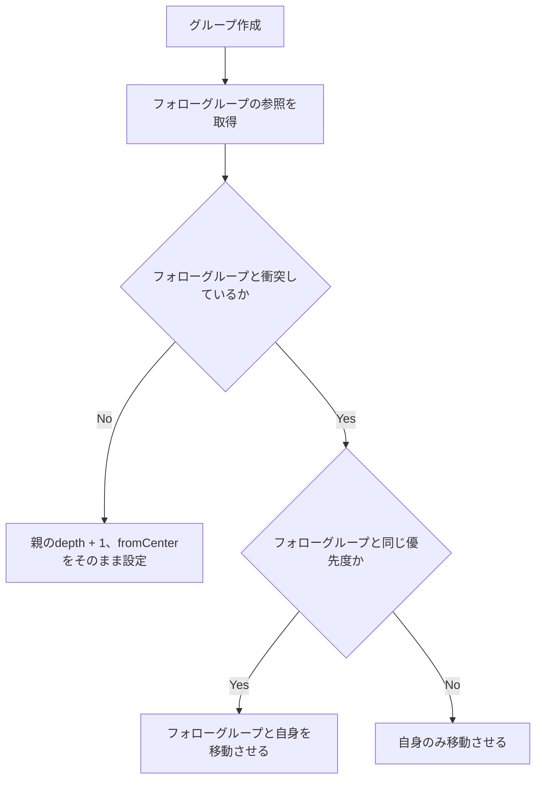

# ツリー画面でのノード位置計算

## 使用モデル

NodeLocation

```dart
NodeLocation {
    int depth;  // ノードの深さ
    double xPos;    // 中心を0としたノードの横座標

}
```

Group

```dart
Group{
    double leftEdgePos;
    double rightEdgePos;
    double width;
}
```

## 計算方法

### 初期値(ルートの場合)

fromTop = 0  
fromCenter = 0

### グループ新規作成の場合（親から初めて生成された子の場合）



### ノード追加の場合

新規作成の衝突検知から再実行。

## 実装する処理

NodeLocationの取得

```dart
NodeLocation nodeLocationManager(NodePath path){}
```

フォローグループの参照取得

```dart
Group followNodeManager(Group group) {}
```

優先度の比較

```dart
bool checkPriority(Group me,Group target){}
```

衝突の計算

```dart
double calcCollision(Group first,Group second){}
```